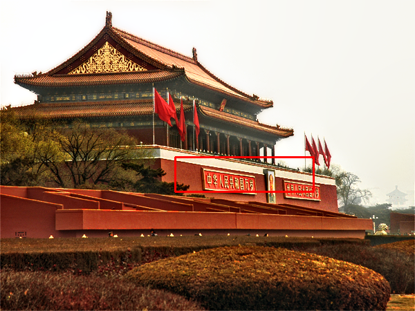
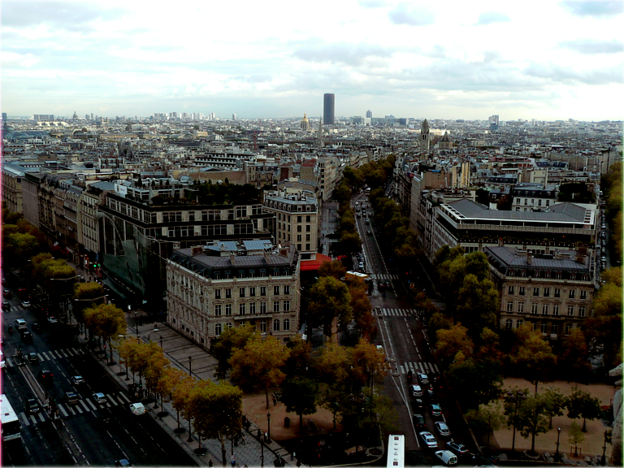

# ImageFusionandStitchingbasedSingleImageDehazing

There are some examples which are compared with other methods.

| Foggy | He   | Fattal | Chen | Berman |  Ours |
| ----- | ---- | ------ | ---- | ------ |  ---- |
|  |  |  |  |  |   |
|  |  |  |  |  |   |

| Foggy | MCNN | DeHazeNet | AOD-Net | GFN | Ours |
| ---- | ------ | ---- | ------ | ------- | ---- |
|  |  |  |  |  |  |
|  |  |  |  |  |  |