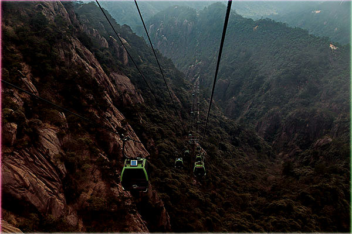

# ImageFusionandStitchingbasedSingleImageDehazing

Since this paper is under review, I can only disclose part of the experimental results. I will disclose the code after the paper is accepted.

There are some examples which are compared with other methods.

| Foggy | He[1] | Fattal[2] | Chen[3] | Berman[4] |  Ours |
| ----- | ---- | ------ | ---- | ------ |  ---- |
|  |  |  |  |  |   |
|  |  |  |  |  |   |

| Foggy | MCNN[5] | DHNet[6] | AODNet[7] | GFN[8] | Ours |
| ---- | ------ | ---- | ------ | ------- | ---- |
|  |  |  |  |  |  |
|  |  |  |  |  |  |

[1] He, K., Sun, J., Tang, X.: Single image haze removal using dark channel prior. IEEE Transactions on Pattern Analysis and Machine Intelligence 33(12), 2341–2353 (2011)

[2] Fattal, R.: Dehazing using color-lines. ACM Transactions on Graphics (TOG) 34(1), No.13 (2014) 

[3] Chen, C., Do, M., Wang, J.: Robust image and video dehazing with visual artifact suppression via gradient residual minimization. In: Proceedings of the European Conference on Computer Vision (ECCV), pp. 576–591 (2016)

[4] Berman, D., Treibitz, T., Avidan, S.: Non-local image dehazing. In: Proceedings of the IEEE International Conference on Computer Vision and Pattern Recognition (CVPR), pp. 1674–1682 (2016)

[5] Ren, W., Liu, S., Zhang, H., Pan, J., Cao, X., Yang, M.: Single image dehazing via multi-scale convolutional neural network. In: Proceedings of the European Conference on Computer Vision (ECCV), pp. 154–169 (2016) 

[6] Cai, B., Xu, X., Jia, K., Qing, C., Tao, D.: DehazeNet: an end-to-end system for single image haze removal. IEEE Transactions on Image Processing 25(11), 5187–5198 (2016)

[7] Li, B., Peng, X., Wang, Z., Xu, J., Feng, D.: AOD-Net: all-in-one dehazing network. In: Proceedings of the IEEE International Conference on Computer Vision (ICCV), pp. 4780–4788 (2017) 

[8] Ren, W., Ma, L., Zhang, J., Pan, J., Cao, X., Liu, W., Yang, M.: Gated fusion network for single image dehazing. In: Proceedings of the IEEE/CVF Conference on Computer Vision and Pattern Recognition (CVPR), pp. 3253–3261 
